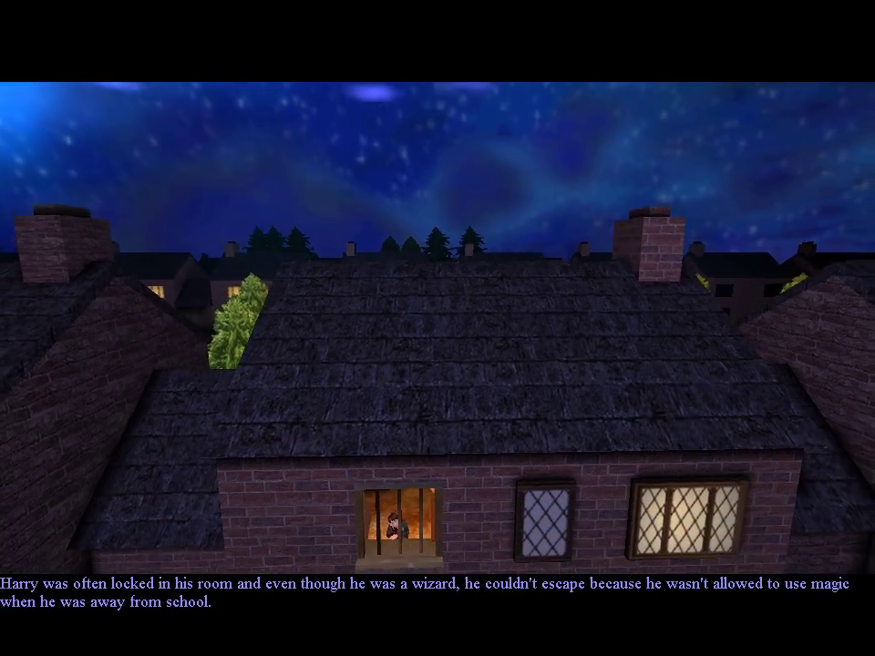
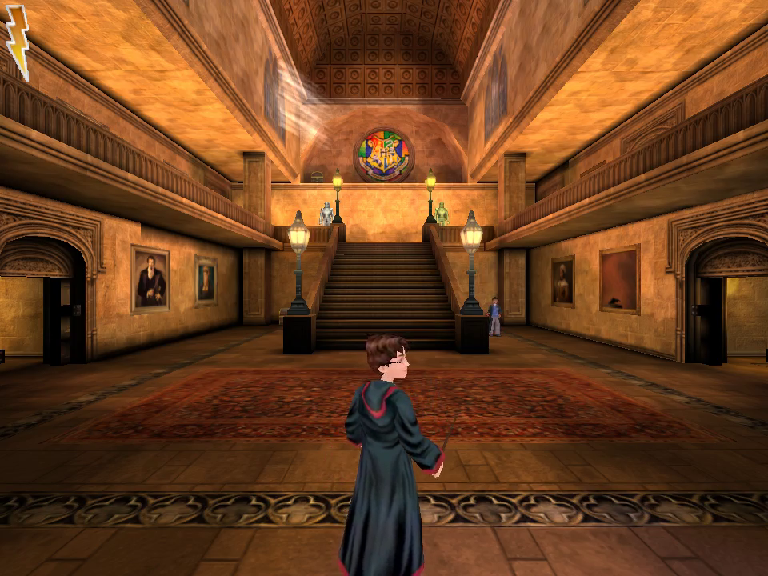
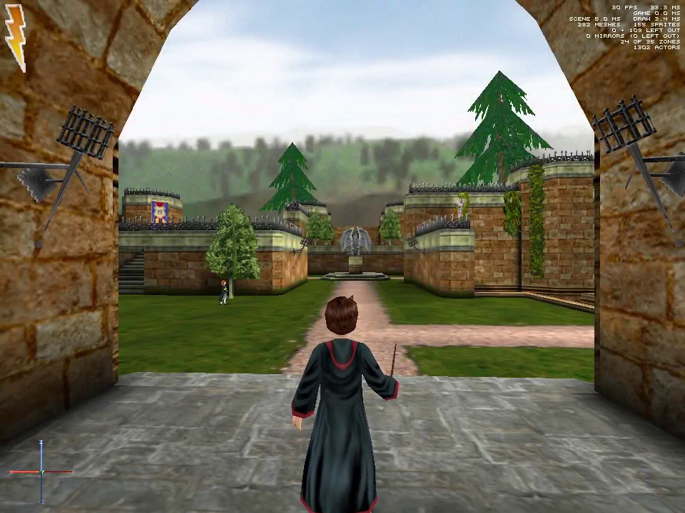
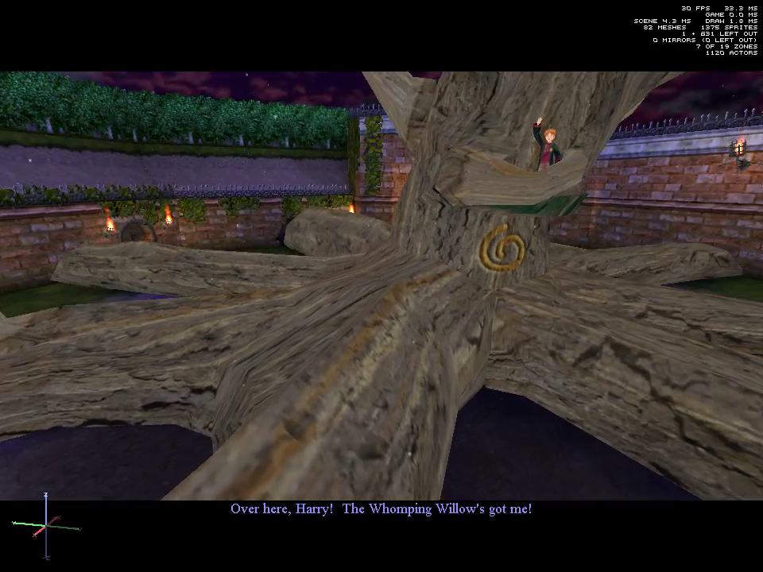
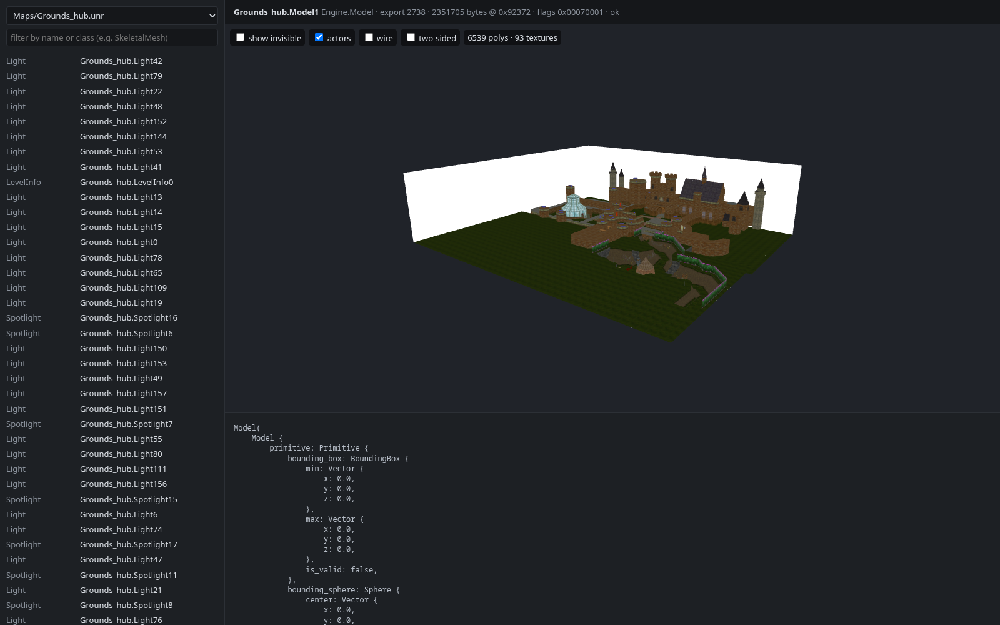
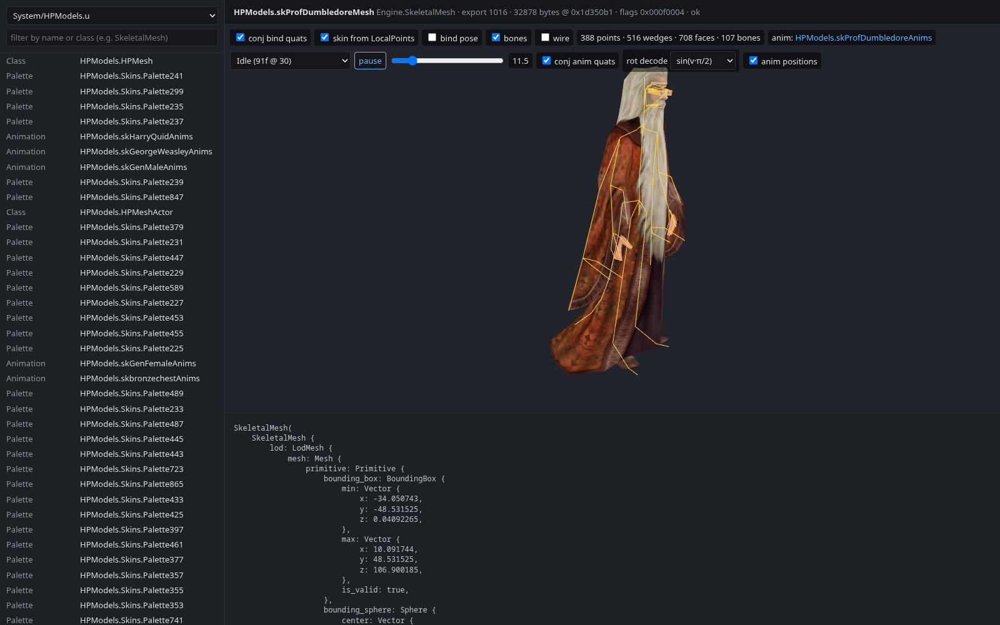
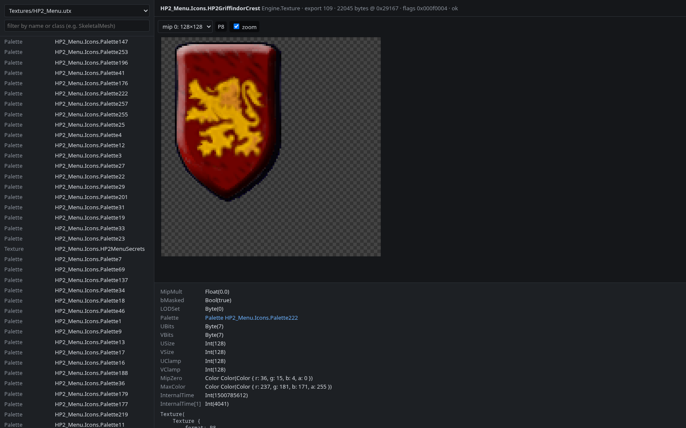
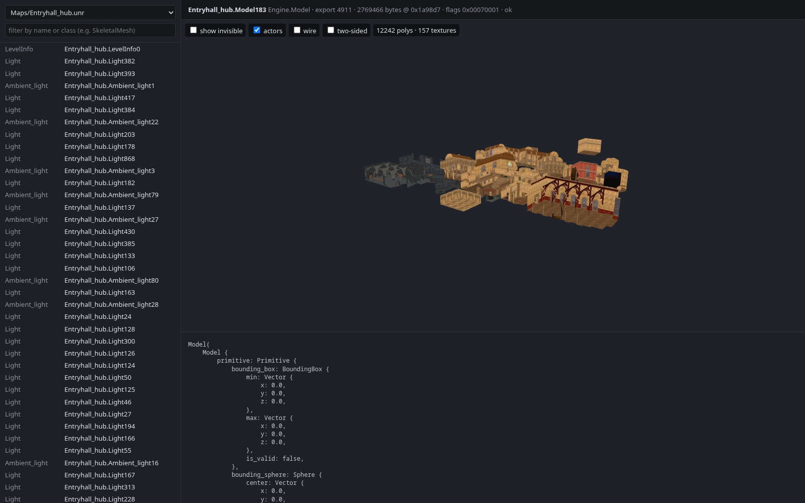

# grim

A from-scratch reimplementation, in Rust, of the engine needed to run **Harry Potter and the
Chamber of Secrets** (PC, 2002), which was built on a modified Unreal Engine 1.

The goal is to play the original game on modern systems from its own data files. The engine
reads the original packages directly and runs the game's own UnrealScript in its own virtual
machine. No code or binaries from the original game or from other engine reimplementations are
used, and this repository contains no game content: you need your own copy of the game.

| Privet Drive | Entrance Hall |
|---|---|
|  |  |
| **Hogwarts grounds, debug mode** | **Whomping Willow, debug mode** |
|  |  |

## Status

**Work in progress.** Expect bugs, missing features and differences from the original.

- Every package of the game is read and decoded: textures, sounds, meshes, animations,
  levels and scripts.
- Levels load and run on the game's own scripts: Harry walks, jumps, climbs and casts
  spells, characters move and talk, cutscenes play with their voices and subtitles, and the
  game's menus work.
- Rendering with the levels' lightmaps, mirrors, particles and procedural textures;
  sound effects, voices and music.
- Developed and tested on Linux, with the Spanish and the English/European releases of the
  game. It is built on portable libraries (wgpu, winit, cpal), but Windows and macOS are
  untested.

## Getting the game data

grim needs an image of the original game disc, as an `.iso` (or a raw `.bin`).

**Linux**, with the disc in the drive (`lsblk` shows its device, usually `/dev/sr0`):

```sh
dd if=/dev/sr0 of=hp2.iso bs=2048 status=progress
```

**macOS**: find the disc with `diskutil list`, then (replacing `disk4` with it):

```sh
diskutil unmountDisk /dev/disk4
dd if=/dev/rdisk4 of=hp2.iso bs=2048
```

**Windows**: a free disc imaging tool such as [ImgBurn](https://www.imgburn.com/) ("Create
image file from disc") or [AnyBurn](https://www.anyburn.com/) ("Copy disc to image file"),
saving as `.iso`.

Then unpack the game from the image into `game/` (needs a [Rust](https://rustup.rs/)
toolchain):

```sh
cargo run --release -p grim-cli -- extract hp2.iso             # English disc
cargo run --release -p grim-cli -- extract hp2.iso game spa    # a disc without English: pick its language
```

The engine looks for the data in `game/HP2`, or wherever `GRIM_GAME_DIR` points.

## Running

Needs a [Rust](https://rustup.rs/) toolchain and, on Linux, the ALSA headers
(`libasound2-dev` or `alsa-lib`).

```sh
cargo run --release -p grim-game -- PrivetDr    # any map name from game/HP2/Maps
```

WASD moves, the mouse looks, Shift runs, Escape opens the menu and Tab releases the mouse.
`--size 1024x768` opens the window at a fixed size.

## Debug tools

Debug mode is on by default (`GRIM_NO_DEBUG=1` turns it off). It shows the frame timings and
the world axes over the game, and adds some keys:

| Key | |
|---|---|
| Delete | free camera, with the game paused; leaving it moves Harry to the camera |
| F4 | the game's own shortcut window, to jump between levels |
| F8 | collision shapes |
| F9 | give Harry every spell |

`grim-play` can also play without a window and record what it draws (needs `ffmpeg`):

```sh
cargo run --release -p grim-game -- Grounds_hub --video grounds.mp4 --seconds 20
```

**grim-viewer** is a local web viewer for everything in the game's packages: levels, meshes
with their skeletons and animations, textures, sounds, and the decoded fields of every object.

```sh
cargo run --release -p grim-viewer    # then open http://127.0.0.1:8765/
```

| Level | Skeletal mesh |
|---|---|
|  |  |
| **Texture** | **Another level** |
|  |  |

**grim** is the command line companion: it validates every package, runs maps and cutscenes
headless and reports what the engine is missing, compares the engine against a saved game of
the original, and dumps packages, exports, bytecode, animations, meshes and textures. Run it
without arguments for the full list.

```sh
cargo run --release -p grim-cli -- survey    # parse every package, summarized by class
cargo run --release -p grim-cli -- run       # run the startup of every map in the VM
cargo test --release                         # includes validation over the real files
```

## License

grim is free software under the [GNU General Public License v3.0](LICENSE). The game's own
data is not covered by it.

## Legal

grim is an independent project for interoperability and education, not affiliated with or
endorsed by Warner Bros. Entertainment, Electronic Arts, KnowWonder or Epic Games. "Harry
Potter" and related names are trademarks of Warner Bros. Entertainment Inc.; "Unreal" is a
trademark of Epic Games, Inc. The repository contains no code, binaries or data from the game
or its engine; the screenshots show the game's data as rendered by grim. Use a copy of the game
you own.
